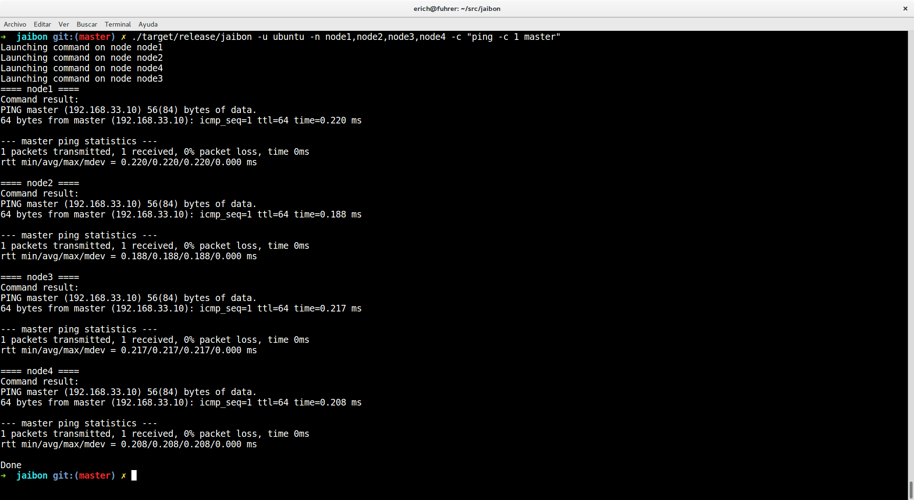

# Jaibon
## A pdsh clon written in Rust

[](https://travis-ci.org/ericho/jaibon)

This is just a little pet project to learn Rust. The intention is to support the concurrent command execution in cluster environments, more specifically on HPC systems. 

## How it works?

`jaibon` works by sending ssh commands to the specified nodes, it works only in Linux (unix like) systems where the `ssh` tool is available. The specified command is appended resulting in something like `ssh user@host cmd`.

This tool asumes that the ssh key configuration was done between nodes as a setup, so the password is not needed.

```
jaibon 0.1.0

USAGE:
    jaibon [OPTIONS] --command <command> --nodes <nodes>

FLAGS:
    -h, --help       Prints help information
    -V, --version    Prints version information

OPTIONS:
    -c, --command <command>    The command to be executed in the remote hosts.
    -n, --nodes <nodes>        Specify the node or list of nodes where the command
                               will be executed. The list of nodes should be set in a
                               separated comma list format.
    -u, --user <user>          Set the username used to perform the SSH connection to
                               the specified hosts. If is not set, the user will be
                               retrieved from the $USER environmental variable.

```

## Installation

This project is under development and it doesn't have a formal release, the installation steps for now are: 

    * Clone this repo
    * Run `cargo install`
    * Execute `jaibon`
    
## Demo

## TODO

- [x] Launch threads instead of loop execution.
- [ ] Refactor on structures, a lot of ugly code.
- [ ] Support of hostlist format

